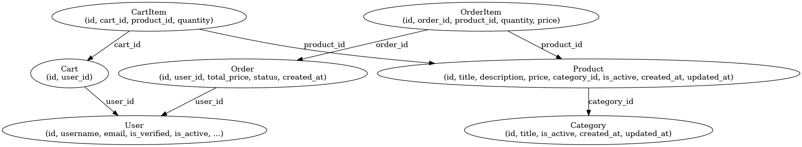

# Coffee Shop API

## Описание
Этот проект представляет собой бэкенд для сети кофеен на вынос. Реализованы основные функции: 
- Управление пользователями (регистрация, аутентификация, роли)
- Управление заказами, меню и корзиной
- Поддержка чата через WebSockets
- Фильтрация, сортировка, пагинация
- Swagger-документация
- Контейнеризация через Docker

## Стек технологий

- Django REST Framework
- PostgreSQL
- Celery
- Redis
- Docker
- Poetry
- pre-commit

## Запуск проекта
### 1. Клонирование репозитория
```sh
git clone https://github.com/bochikas/coffee-shop
cd coffee-shop
```

### 2. Заполнение .env и .env.docker
```
# DB
POSTGRES_DB=coffe_shop_db
POSTGRES_USER=postgres
POSTGRES_PASSWORD=postgres
POSTGRES_HOST=db
POSTGRES_PORT=5432

# Django
SECRET_KEY='123abc123abc'
ALLOWED_HOSTS='127.0.0.1 localhost 0.0.0.0'
INTERNAL_IPS="127.0.0.1 localhost"
DEBUG=False

# API
API_PORT=8000

# Redis
REDIS_URL='redis://redis:6379/0'

# EMAIL
EMAIL_HOST=smtp.gmail.com
EMAIL_PORT=587
EMAIL_HOST_USER=your_email@gmail.com
EMAIL_HOST_PASSWORD=password_or_token
```
### 3. Запуск
```
make build
```

### 4. Доступ к API
- Swagger UI: [http://localhost:8000/api/v1/swagger/](http://localhost:8000/api/v1/swagger/)
- API (базовый URL): `http://localhost:8000/api/`

## Схема БД


## Авторы
- [Kambarov Damir](https://github.com/bochikas)